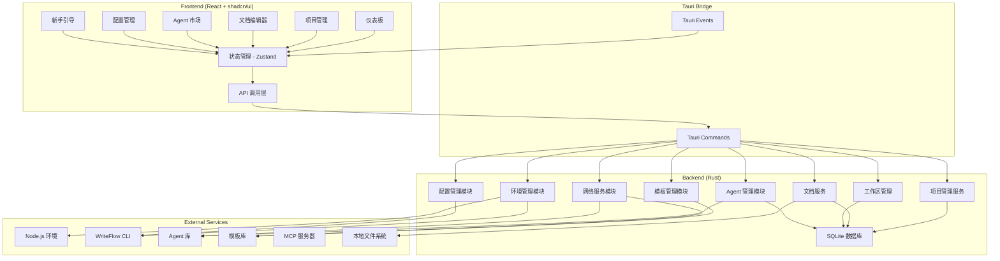

# WriteFlow Studio - 技术架构设计

> **Version**: 1.0.0  
> **Date**: 2025-09-07   
> **Author**: WriteFlow Team

## 1. 架构概览

### 1.1 技术栈

WriteFlow Studio 作为完整生态管理平台，采用现代化的技术栈：

- **应用框架**: Tauri 2.0 - 轻量级跨平台桌面应用框架
- **前端**: React 18 + TypeScript 5.0+ - 现代化前端开发
- **UI 框架**: shadcn/ui + Tailwind CSS - 高质量组件库和样式系统
- **状态管理**: Zustand - 轻量级状态管理解决方案
- **构建工具**: Vite 5.0+ - 快速的前端构建工具
- **后端**: Rust + Tauri Backend - 高性能原生后端
- **数据存储**: SQLite + serde - 本地数据管理和序列化
- **网络通信**: reqwest + tokio - 异步网络请求和 Agent 下载

### 1.2 整体架构



### 1.3 核心设计原则

- **一站式写作平台**: 集项目管理、文档编辑、AI 助手于一体的完整解决方案
- **零门槛设计**: 为非技术用户提供完全自动化的使用体验
- **专业级项目管理**: 支持复杂写作项目的结构化管理和版本控制
- **智能化写作体验**: AI 驱动的内容生成、校对和协作功能
- **完整生态管理**: 从环境安装到 Agent 管理的一站式服务
- **智能化引导**: 基于用户身份和场景的个性化推荐
- **100% 兼容性**: 与现有 WriteFlow CLI 完全兼容和同步
- **模块化架构**: 清晰的功能模块和可扩展设计
- **安全优先**: 本地优先的数据存储和 Agent 安全管理
- **高性能体验**: 原生性能，启动时间 < 5 秒（含环境检测）
- **多格式支持**: 支持 Markdown、Word、PDF 等多种格式的导入导出和预览

## 2. 前端架构

### 2.1 React 组件架构

```
src/
├── components/                    # 通用组件
│   ├── ui/                       # shadcn/ui 基础组件
│   ├── layout/                   # 布局组件
│   ├── common/                   # 通用业务组件
│   ├── forms/                    # 表单组件
│   ├── agent/                    # Agent 相关组件
│   ├── environment/              # 环境管理组件
│   ├── project/                  # 项目管理组件
│   ├── document/                 # 文档编辑组件
│   │   ├── editor/               # 编辑器核心组件
│   │   ├── preview/              # 预览组件
│   │   ├── outline/              # 大纲组件
│   │   └── toolbar/              # 工具栏组件
│   └── onboarding/               # 新手引导组件
├── pages/                        # 页面组件
│   ├── Dashboard/                # 仪表板页面
│   ├── ProjectManager/           # 项目管理页面
│   │   ├── ProjectList/          # 项目列表
│   │   ├── ProjectDetail/        # 项目详情
│   │   ├── WorkspaceSelector/    # 工作区选择器
│   │   └── ProjectStats/         # 项目统计
│   ├── DocumentEditor/           # 文档编辑页面
│   │   ├── EditorLayout/         # 编辑器布局
│   │   ├── DocumentTree/         # 文档树
│   │   ├── MarkdownEditor/       # Markdown 编辑器
│   │   └── AIAssistant/          # AI 助手面板
│   ├── AgentMarket/              # Agent 市场
│   ├── Environment/              # 环境管理
│   ├── Onboarding/               # 新手引导
│   ├── Knowledge/                # 知识库
│   ├── Templates/                # 模板中心
│   ├── AIProviders/              # AI 提供商配置
│   ├── MCPServers/               # MCP 服务器设置
│   ├── WritingPreferences/       # 写作偏好
│   ├── ProjectConfig/            # 项目配置
│   └── Settings/                 # 应用设置
├── hooks/                        # 自定义 Hooks
├── stores/                       # Zustand 状态管理
│   ├── projectStore.ts           # 项目管理状态
│   ├── documentStore.ts          # 文档编辑状态
│   ├── workspaceStore.ts         # 工作区状态
│   ├── environmentStore.ts       # 环境状态
│   ├── agentStore.ts             # Agent 状态
│   ├── templateStore.ts          # 模板状态
│   ├── onboardingStore.ts        # 引导状态
│   └── configStore.ts            # 配置状态
├── services/                     # API 服务层
├── utils/                        # 工具函数
├── types/                        # TypeScript 类型定义
└── constants/                    # 常量定义
```

### 2.2 状态管理架构

使用 Zustand 进行状态管理，按功能模块划分：

```typescript
// 环境管理状态
interface EnvironmentStore {
  environmentStatus: {
    nodeJs: 'not_installed' | 'installed' | 'outdated'
    writeflowCli: 'not_installed' | 'installed' | 'outdated'
    dependencies: DependencyStatus[]
  }
  checkEnvironment: () => Promise<void>
  installNodeJs: () => Promise<InstallResult>
  installWriteFlowCLI: () => Promise<InstallResult>
  repairEnvironment: () => Promise<RepairResult>
}

// Agent 管理状态
interface AgentStore {
  availableAgents: Agent[]
  installedAgents: InstalledAgent[]
  categories: AgentCategory[]
  searchQuery: string
  selectedCategory: string | null
  
  // 市场功能
  loadAvailableAgents: () => Promise<void>
  searchAgents: (query: string) => void
  filterByCategory: (category: string) => void
  
  // 管理功能
  installAgent: (agentId: string) => Promise<InstallResult>
  uninstallAgent: (agentId: string) => Promise<boolean>
  enableAgent: (agentId: string) => Promise<boolean>
  disableAgent: (agentId: string) => Promise<boolean>
  updateAgent: (agentId: string) => Promise<UpdateResult>
}

// 模板管理状态
interface TemplateStore {
  templates: Template[]
  categories: TemplateCategory[]
  userTemplates: UserTemplate[]
  
  loadTemplates: () => Promise<void>
  createFromTemplate: (templateId: string, options: CreateOptions) => Promise<string>
  saveAsTemplate: (content: string, metadata: TemplateMetadata) => Promise<boolean>
  shareTemplate: (templateId: string) => Promise<ShareResult>
}

// 项目管理状态
interface ProjectStore {
  projects: Project[]
  currentProject: Project | null
  projectStats: ProjectStats
  searchQuery: string
  filterStatus: 'all' | 'active' | 'completed' | 'archived'
  viewMode: 'grid' | 'list'
  
  // 项目管理
  createProject: (projectData: CreateProjectData) => Promise<Project>
  openProject: (projectId: string) => Promise<void>
  updateProject: (projectId: string, updates: Partial<Project>) => Promise<void>
  deleteProject: (projectId: string) => Promise<boolean>
  archiveProject: (projectId: string) => Promise<boolean>
  duplicateProject: (projectId: string) => Promise<Project>
  
  // 项目搜索和过滤
  searchProjects: (query: string) => void
  filterProjects: (status: string) => void
  sortProjects: (field: string, order: 'asc' | 'desc') => void
  
  // 统计和分析
  loadProjectStats: () => Promise<void>
  getProjectProgress: (projectId: string) => Promise<number>
  getProjectAnalytics: (projectId: string) => Promise<ProjectAnalytics>
}

// 工作区管理状态
interface WorkspaceStore {
  workspaces: Workspace[]
  currentWorkspace: Workspace | null
  
  // 工作区管理
  createWorkspace: (workspaceData: CreateWorkspaceData) => Promise<Workspace>
  switchWorkspace: (workspaceId: string) => Promise<void>
  updateWorkspace: (workspaceId: string, updates: Partial<Workspace>) => Promise<void>
  deleteWorkspace: (workspaceId: string) => Promise<boolean>
  
  // 环境隔离
  getWorkspaceConfig: (workspaceId: string) => Promise<WorkspaceConfig>
  saveWorkspaceConfig: (workspaceId: string, config: WorkspaceConfig) => Promise<void>
}

// 文档编辑状态
interface DocumentStore {
  documents: DocumentNode[]
  currentDocument: Document | null
  documentTree: DocumentTree
  editorState: EditorState
  previewMode: boolean
  showOutline: boolean
  
  // 文档管理
  createDocument: (parentId: string | null, documentData: CreateDocumentData) => Promise<Document>
  openDocument: (documentId: string) => Promise<void>
  saveDocument: (documentId: string, content: string) => Promise<void>
  deleteDocument: (documentId: string) => Promise<boolean>
  moveDocument: (documentId: string, newParentId: string | null) => Promise<void>
  renameDocument: (documentId: string, newName: string) => Promise<void>
  
  // 编辑器功能
  updateContent: (content: string) => void
  insertText: (text: string, position?: number) => void
  formatText: (format: TextFormat, range?: TextRange) => void
  togglePreview: () => void
  toggleOutline: () => void
  
  // AI 写作助手
  generateContent: (prompt: string, context?: string) => Promise<string>
  improveContent: (content: string, options: ImprovementOptions) => Promise<string>
  checkGrammar: (content: string) => Promise<GrammarCheck[]>
  
  // 协作功能
  shareDocument: (documentId: string, permissions: SharePermissions) => Promise<ShareLink>
  trackChanges: (documentId: string) => Promise<ChangeLog[]>
  resolveConflict: (documentId: string, resolution: ConflictResolution) => Promise<void>
  
  // 导入导出
  exportDocument: (documentId: string, format: ExportFormat) => Promise<ExportResult>
  importDocument: (file: File, options: ImportOptions) => Promise<Document>
}

// 新手引导状态
interface OnboardingStore {
  userProfile: {
    identity: 'student' | 'writer' | 'business' | 'developer'
    useCases: string[]
    techLevel: 'beginner' | 'intermediate' | 'advanced'
  }
  currentStep: number
  totalSteps: number
  isCompleted: boolean
  
  setUserProfile: (profile: Partial<UserProfile>) => void
  nextStep: () => void
  previousStep: () => void
  completeOnboarding: () => Promise<void>
  getRecommendations: () => Recommendation[]
}

// 仪表板状态
interface DashboardStore {
  stats: {
    writingStats: WritingStats
    agentUsage: AgentUsageStats
    systemHealth: SystemHealthStats
  }
  recentProjects: RecentProject[]
  recommendations: DashboardRecommendation[]
  
  loadDashboardData: () => Promise<void>
  refreshStats: () => Promise<void>
}
```

### 2.3 新增核心组件设计

#### Agent 市场组件

```typescript
interface AgentMarketProps {
  category?: string
  searchQuery?: string
  onInstall: (agent: Agent) => Promise<void>
}

const AgentMarket: React.FC<AgentMarketProps> = ({
  category,
  searchQuery,
  onInstall
}) => {
  const { availableAgents, categories, loading } = useAgentStore()
  
  return (
    <div className="agent-market">
      <AgentCategories 
        categories={categories}
        selected={category}
        onSelect={setCategory}
      />
      
      <AgentGrid 
        agents={filteredAgents}
        loading={loading}
        onInstall={onInstall}
        renderAgent={(agent) => (
          <AgentCard
            key={agent.id}
            agent={agent}
            onInstall={() => onInstall(agent)}
          />
        )}
      />
    </div>
  )
}
```

#### 环境管理组件

```typescript
interface EnvironmentPanelProps {
  onRepairComplete?: () => void
}

const EnvironmentPanel: React.FC<EnvironmentPanelProps> = ({
  onRepairComplete
}) => {
  const { environmentStatus, checkEnvironment, repairEnvironment } = useEnvironmentStore()
  
  return (
    <Card>
      <CardHeader>
        <CardTitle>环境状态</CardTitle>
      </CardHeader>
      
      <CardContent>
        <EnvironmentStatus status={environmentStatus} />
        
        {environmentStatus.hasIssues && (
          <Button 
            onClick={repairEnvironment}
            className="mt-4"
          >
            一键修复
          </Button>
        )}
      </CardContent>
    </Card>
  )
}
```

#### 新手引导组件

```typescript
interface OnboardingWizardProps {
  onComplete: (profile: UserProfile) => void
}

const OnboardingWizard: React.FC<OnboardingWizardProps> = ({ onComplete }) => {
  const { 
    currentStep, 
    totalSteps, 
    userProfile, 
    nextStep, 
    previousStep,
    setUserProfile 
  } = useOnboardingStore()
  
  const steps = [
    <WelcomeStep key="welcome" />,
    <IdentityStep 
      key="identity" 
      value={userProfile.identity}
      onChange={(identity) => setUserProfile({ identity })}
    />,
    <UseCaseStep 
      key="usecase"
      value={userProfile.useCases}
      onChange={(useCases) => setUserProfile({ useCases })}
    />,
    <RecommendationStep key="recommendation" profile={userProfile} />
  ]
  
  return (
    <div className="onboarding-wizard">
      <ProgressBar current={currentStep} total={totalSteps} />
      
      <div className="step-content">
        {steps[currentStep]}
      </div>
      
      <div className="step-actions">
        {currentStep > 0 && (
          <Button variant="outline" onClick={previousStep}>
            上一步
          </Button>
        )}
        
        <Button onClick={nextStep}>
          {currentStep === totalSteps - 1 ? '完成' : '下一步'}
        </Button>
      </div>
    </div>
  )
}
```

#### shadcn/ui 组件集成

基于 shadcn/ui 构建一致的设计系统：

```typescript
// 核心组件
import { Button } from "@/components/ui/button"
import { Input } from "@/components/ui/input"
import { Label } from "@/components/ui/label"
import { Card } from "@/components/ui/card"
import { Select } from "@/components/ui/select"
import { Switch } from "@/components/ui/switch"
import { Tabs } from "@/components/ui/tabs"
import { Dialog } from "@/components/ui/dialog"
import { Form } from "@/components/ui/form"
import { Toast } from "@/components/ui/toast"

// 自定义业务组件
interface ConfigCardProps {
  title: string
  description?: string
  status?: 'connected' | 'disconnected' | 'testing'
  actions?: React.ReactNode
  children: React.ReactNode
}
```

#### 动态表单组件架构

```typescript
// Agent 安装向导
interface AgentInstallWizardProps {
  agent: Agent
  onComplete: (result: InstallResult) => void
  onCancel: () => void
}

const AgentInstallWizard: React.FC<AgentInstallWizardProps> = ({
  agent,
  onComplete,
  onCancel
}) => {
  const [step, setStep] = useState<'download' | 'install' | 'configure'>('download')
  const [progress, setProgress] = useState(0)
  
  return (
    <Dialog>
      <DialogContent>
        <DialogHeader>
          <DialogTitle>安装 {agent.name}</DialogTitle>
        </DialogHeader>
        
        <div className="install-progress">
          <Progress value={progress} />
          <p className="text-sm text-muted-foreground mt-2">
            {getStepDescription(step)}
          </p>
        </div>
        
        <div className="flex justify-end gap-2">
          <Button variant="outline" onClick={onCancel}>
            取消
          </Button>
        </div>
      </DialogContent>
    </Dialog>
  )
}

// 环境诊断组件
interface EnvironmentDiagnosticsProps {
  onRepair: (issues: EnvironmentIssue[]) => Promise<void>
}

const EnvironmentDiagnostics: React.FC<EnvironmentDiagnosticsProps> = ({
  onRepair
}) => {
  const [issues, setIssues] = useState<EnvironmentIssue[]>([])
  const [diagnosing, setDiagnosing] = useState(false)
  
  return (
    <Card>
      <CardHeader>
        <CardTitle className="flex items-center gap-2">
          <AlertTriangle className="h-5 w-5" />
          环境诊断
        </CardTitle>
      </CardHeader>
      
      <CardContent>
        {issues.length > 0 ? (
          <div className="space-y-3">
            {issues.map((issue, index) => (
              <EnvironmentIssueItem 
                key={index}
                issue={issue}
                onFix={() => fixSingleIssue(issue)}
              />
            ))}
            
            <Button 
              onClick={() => onRepair(issues)}
              className="w-full mt-4"
            >
              一键修复所有问题
            </Button>
          </div>
        ) : (
          <div className="text-center py-8">
            <Check className="h-12 w-12 text-green-500 mx-auto mb-4" />
            <p>环境状态良好！</p>
          </div>
        )}
      </CardContent>
    </Card>
  )
}
```

## 3. 后端架构

### 3.1 Rust 模块结构

```
src-tauri/
├── src/
│   ├── main.rs                   # 应用入口
│   ├── commands/                 # Tauri Commands
│   │   ├── environment.rs       # 环境管理命令
│   │   ├── agent.rs             # Agent 管理命令
│   │   ├── template.rs          # 模板管理命令
│   │   ├── onboarding.rs        # 新手引导命令
│   │   ├── config.rs            # 配置相关命令
│   │   ├── providers.rs         # AI 提供商命令
│   │   ├── mcp.rs               # MCP 服务器命令
│   │   └── validation.rs        # 配置验证命令
│   ├── services/                # 业务服务
│   │   ├── environment_manager.rs # 环境检测和安装
│   │   ├── agent_manager.rs     # Agent 生命周期管理
│   │   ├── template_manager.rs  # 模板管理
│   │   ├── network_service.rs   # 网络请求服务
│   │   ├── config_manager.rs    # 配置文件管理
│   │   ├── file_watcher.rs      # 文件变更监听
│   │   ├── process_manager.rs   # 进程管理
│   │   └── validation.rs        # 配置验证
│   ├── models/                  # 数据模型
│   │   ├── environment.rs       # 环境状态模型
│   │   ├── agent.rs             # Agent 模型
│   │   ├── template.rs          # 模板模型
│   │   ├── user.rs              # 用户模型
│   │   ├── config.rs            # 配置数据结构
│   │   ├── providers.rs         # 提供商模型
│   │   └── mcp.rs               # MCP 模型
│   ├── database/                # 数据库相关
│   │   ├── mod.rs               # 数据库模块
│   │   ├── schema.rs            # 数据库表结构
│   │   └── migrations.rs        # 数据库迁移
│   ├── utils/                   # 工具函数
│   └── error.rs                 # 错误处理
├── Cargo.toml                   # Rust 依赖配置
└── tauri.conf.json              # Tauri 配置
```

### 3.2 新增核心服务模块

#### 环境管理服务

```rust
pub struct EnvironmentManager {
    db: Arc<Database>,
    node_detector: NodeJSDetector,
    cli_manager: WriteFlowCLIManager,
}

impl EnvironmentManager {
    pub async fn check_environment(&self) -> Result<EnvironmentStatus> {
        let nodejs_status = self.node_detector.check_installation().await?;
        let cli_status = self.cli_manager.check_installation().await?;
        let dependencies = self.check_dependencies().await?;
        
        Ok(EnvironmentStatus {
            nodejs: nodejs_status,
            writeflow_cli: cli_status,
            dependencies,
            overall_health: self.calculate_health(&nodejs_status, &cli_status, &dependencies),
        })
    }
    
    pub async fn install_nodejs(&self) -> Result<InstallResult> {
        // 下载并安装 Node.js LTS 版本
    }
    
    pub async fn install_writeflow_cli(&self) -> Result<InstallResult> {
        // 使用 npm 安装 WriteFlow CLI
    }
    
    pub async fn repair_environment(&self, issues: Vec<EnvironmentIssue>) -> Result<RepairResult> {
        // 批量修复环境问题
    }
}
```

#### Agent 管理服务

```rust
pub struct AgentManager {
    db: Arc<Database>,
    network: Arc<NetworkService>,
    agent_store_url: String,
    local_agent_path: PathBuf,
}

impl AgentManager {
    pub async fn load_available_agents(&self) -> Result<Vec<Agent>> {
        let agents = self.network.fetch_agents_catalog().await?;
        self.db.cache_agents(&agents).await?;
        Ok(agents)
    }
    
    pub async fn install_agent(&self, agent_id: &str) -> Result<InstallResult> {
        // 1. 下载 Agent 文件
        let agent_package = self.network.download_agent(agent_id).await?;
        
        // 2. 验证签名和完整性
        self.verify_agent_package(&agent_package)?;
        
        // 3. 解压并安装
        let install_path = self.extract_agent(&agent_package).await?;
        
        // 4. 更新数据库记录
        self.db.mark_agent_installed(agent_id, &install_path).await?;
        
        Ok(InstallResult::Success(install_path))
    }
    
    pub async fn uninstall_agent(&self, agent_id: &str) -> Result<bool> {
        // 安全卸载 Agent 和相关文件
    }
    
    pub async fn update_agent(&self, agent_id: &str) -> Result<UpdateResult> {
        // 检查更新并升级
    }
}
```

#### 模板管理服务

```rust
pub struct TemplateManager {
    db: Arc<Database>,
    network: Arc<NetworkService>,
    local_template_path: PathBuf,
}

impl TemplateManager {
    pub async fn load_templates(&self) -> Result<Vec<Template>> {
        let templates = self.network.fetch_templates_catalog().await?;
        self.db.cache_templates(&templates).await?;
        Ok(templates)
    }
    
    pub async fn create_from_template(&self, template_id: &str, options: CreateOptions) -> Result<String> {
        let template = self.db.get_template(template_id).await?;
        let content = template.render_with_options(options)?;
        
        // 创建新文档或项目
        let output_path = self.create_project_from_content(&content, &options).await?;
        Ok(output_path)
    }
    
    pub async fn save_as_template(&self, content: &str, metadata: TemplateMetadata) -> Result<String> {
        let template = self.create_user_template(content, metadata).await?;
        let template_id = self.db.save_user_template(&template).await?;
        Ok(template_id)
    }
}
```

#### 网络服务模块

```rust
pub struct NetworkService {
    client: reqwest::Client,
    agent_store_url: String,
    template_store_url: String,
}

impl NetworkService {
    pub async fn fetch_agents_catalog(&self) -> Result<Vec<Agent>> {
        let response = self.client
            .get(&format!("{}/agents", self.agent_store_url))
            .send()
            .await?;
        
        let agents: Vec<Agent> = response.json().await?;
        Ok(agents)
    }
    
    pub async fn download_agent(&self, agent_id: &str) -> Result<AgentPackage> {
        let url = format!("{}/agents/{}/download", self.agent_store_url, agent_id);
        
        let response = self.client
            .get(&url)
            .send()
            .await?;
        
        let bytes = response.bytes().await?;
        Ok(AgentPackage::from_bytes(bytes)?)
    }
    
    pub async fn search_agents(&self, query: &str, category: Option<&str>) -> Result<Vec<Agent>> {
        let mut url = format!("{}/agents/search?q={}", self.agent_store_url, query);
        
        if let Some(cat) = category {
            url.push_str(&format!("&category={}", cat));
        }
        
        let response = self.client.get(&url).send().await?;
        let agents: Vec<Agent> = response.json().await?;
        Ok(agents)
    }
}
```

### 3.3 Tauri Commands API

#### 环境管理命令

```rust
#[tauri::command]
pub async fn check_environment() -> Result<EnvironmentStatus, String> {
    let manager = EnvironmentManager::new()?;
    manager.check_environment().await
        .map_err(|e| e.to_string())
}

#[tauri::command]
pub async fn install_nodejs() -> Result<InstallResult, String> {
    let manager = EnvironmentManager::new()?;
    manager.install_nodejs().await
        .map_err(|e| e.to_string())
}

#[tauri::command]
pub async fn install_writeflow_cli() -> Result<InstallResult, String> {
    let manager = EnvironmentManager::new()?;
    manager.install_writeflow_cli().await
        .map_err(|e| e.to_string())
}

#[tauri::command]
pub async fn repair_environment(issues: Vec<EnvironmentIssue>) -> Result<RepairResult, String> {
    let manager = EnvironmentManager::new()?;
    manager.repair_environment(issues).await
        .map_err(|e| e.to_string())
}
```

#### Agent 管理命令

```rust
#[tauri::command]
pub async fn load_available_agents() -> Result<Vec<Agent>, String> {
    let manager = AgentManager::new().await?;
    manager.load_available_agents().await
        .map_err(|e| e.to_string())
}

#[tauri::command]
pub async fn search_agents(query: String, category: Option<String>) -> Result<Vec<Agent>, String> {
    let manager = AgentManager::new().await?;
    let network = manager.get_network_service();
    network.search_agents(&query, category.as_deref()).await
        .map_err(|e| e.to_string())
}

#[tauri::command]
pub async fn install_agent(agent_id: String) -> Result<InstallResult, String> {
    let manager = AgentManager::new().await?;
    manager.install_agent(&agent_id).await
        .map_err(|e| e.to_string())
}

#[tauri::command]
pub async fn uninstall_agent(agent_id: String) -> Result<bool, String> {
    let manager = AgentManager::new().await?;
    manager.uninstall_agent(&agent_id).await
        .map_err(|e| e.to_string())
}

#[tauri::command]
pub async fn get_installed_agents() -> Result<Vec<InstalledAgent>, String> {
    let manager = AgentManager::new().await?;
    manager.get_installed_agents().await
        .map_err(|e| e.to_string())
}
```

#### 模板管理命令

```rust
#[tauri::command]
pub async fn load_templates() -> Result<Vec<Template>, String> {
    let manager = TemplateManager::new().await?;
    manager.load_templates().await
        .map_err(|e| e.to_string())
}

#[tauri::command]
pub async fn create_from_template(template_id: String, options: CreateOptions) -> Result<String, String> {
    let manager = TemplateManager::new().await?;
    manager.create_from_template(&template_id, options).await
        .map_err(|e| e.to_string())
}

#[tauri::command]
pub async fn save_as_template(content: String, metadata: TemplateMetadata) -> Result<String, String> {
    let manager = TemplateManager::new().await?;
    manager.save_as_template(&content, metadata).await
        .map_err(|e| e.to_string())
}
```

#### 新手引导命令

```rust
#[tauri::command]
pub async fn save_user_profile(profile: UserProfile) -> Result<(), String> {
    let db = Database::new().await?;
    db.save_user_profile(&profile).await
        .map_err(|e| e.to_string())
}

#[tauri::command]
pub async fn get_recommendations(profile: UserProfile) -> Result<Vec<Recommendation>, String> {
    let recommender = RecommendationEngine::new();
    Ok(recommender.get_recommendations_for_profile(&profile))
}

#[tauri::command]
pub async fn apply_recommended_setup(recommendations: Vec<String>) -> Result<SetupResult, String> {
    let setup_manager = SetupManager::new().await?;
    setup_manager.apply_recommendations(recommendations).await
        .map_err(|e| e.to_string())
}
```

#### 原有配置命令（保留）

```rust
#[tauri::command]
pub async fn load_global_config() -> Result<GlobalConfig, String> {
    // 加载全局配置
}

#[tauri::command]
pub async fn save_global_config(config: GlobalConfig) -> Result<(), String> {
    // 保存全局配置
}

#[tauri::command]
pub async fn test_api_connection(profile: ModelProfile) -> Result<ConnectionResult, String> {
    // 测试 API 连接
}
```

## 4. 配置集成方案

### 4.1 配置文件兼容性

WriteFlow Studio 完全兼容现有配置文件格式：

```typescript
// 全局配置文件 (~/.writeflow.json)
interface GlobalConfig {
  modelProfiles: ModelProfile[]
  modelPointers: ModelPointers
  writingPreferences: WritingPreferences
  mcpServers: Record<string, McpServerConfig>
  // ... 其他配置项
}

// 项目配置文件 (./.writeflow.json)
interface ProjectConfig {
  allowedTools: string[]
  context: Record<string, string>
  mcpContextUris: string[]
  // ... 其他项目特定配置
}
```

### 4.2 配置同步机制

#### 实时文件监听

```rust
// 监听配置文件变更
pub struct FileWatcher {
    watcher: RecommendedWatcher,
    rx: Receiver<DebouncedEvent>,
}

impl FileWatcher {
    pub fn watch_config_file(&mut self, path: &Path) -> Result<()> {
        self.watcher.watch(path, RecursiveMode::NonRecursive)?;
        Ok(())
    }
    
    pub async fn handle_config_change(&self, event: DebouncedEvent) {
        match event {
            DebouncedEvent::Write(path) => {
                // 通知前端配置已更改
                emit_config_changed(path).await;
            }
            _ => {}
        }
    }
}
```

#### 配置冲突处理

```typescript
interface ConfigConflict {
  source: 'studio' | 'cli' | 'external'
  timestamp: number
  conflictType: 'overwrite' | 'merge' | 'manual'
  resolution?: 'use_studio' | 'use_external' | 'merge_both'
}

const resolveConfigConflict = async (conflict: ConfigConflict): Promise<void> => {
  switch (conflict.resolution) {
    case 'use_studio':
      await saveConfigFromStudio()
      break
    case 'use_external':
      await loadConfigFromFile()
      break
    case 'merge_both':
      await mergeConfigurations()
      break
  }
}
```

### 4.3 CLI 集成接口

#### 配置命令桥接

```rust
// 调用 WriteFlow CLI 命令
pub async fn execute_writeflow_command(command: &str, args: Vec<&str>) -> Result<String> {
    let output = Command::new("writeflow")
        .arg(command)
        .args(args)
        .output()
        .await?;
    
    if output.status.success() {
        Ok(String::from_utf8(output.stdout)?)
    } else {
        Err(String::from_utf8(output.stderr)?)
    }
}

// 检查 WriteFlow CLI 版本兼容性
pub async fn check_cli_compatibility() -> Result<CompatibilityInfo> {
    let version_output = execute_writeflow_command("--version", vec![]).await?;
    let version = parse_version(&version_output)?;
    
    Ok(CompatibilityInfo {
        cli_version: version,
        is_compatible: version >= MIN_SUPPORTED_VERSION,
        required_version: MIN_SUPPORTED_VERSION,
    })
}
```

## 5. 性能优化策略

### 5.1 前端性能优化

#### 组件懒加载

```typescript
// 路由级别的代码分割
const AIProviders = lazy(() => import('./pages/AIProviders'))
const MCPServers = lazy(() => import('./pages/MCPServers'))
const WritingPreferences = lazy(() => import('./pages/WritingPreferences'))

// 大型组件的懒加载
const ConfigEditor = lazy(() => import('./components/ConfigEditor'))
```

#### 状态优化

```typescript
// 使用 Zustand 的选择器避免不必要的重渲染
const useAIProviders = () => useAIProviderStore(state => state.providers)
const useActiveProvider = () => useAIProviderStore(state => state.activeProvider)

// 配置缓存策略
const useConfigCache = () => {
  const [cache, setCache] = useState<Map<string, any>>(new Map())
  
  const getCachedConfig = useCallback((key: string) => {
    return cache.get(key)
  }, [cache])
  
  const setCachedConfig = useCallback((key: string, value: any) => {
    setCache(prev => new Map(prev).set(key, value))
  }, [])
  
  return { getCachedConfig, setCachedConfig }
}
```

### 5.2 后端性能优化

#### 异步配置操作

```rust
// 使用 tokio 进行异步配置操作
pub struct ConfigManager {
    config_cache: Arc<RwLock<HashMap<String, serde_json::Value>>>,
}

impl ConfigManager {
    pub async fn load_config_async(&self, path: &Path) -> Result<serde_json::Value> {
        // 先检查缓存
        {
            let cache = self.config_cache.read().await;
            if let Some(cached) = cache.get(path.to_str().unwrap()) {
                return Ok(cached.clone());
            }
        }
        
        // 异步读取文件
        let content = tokio::fs::read_to_string(path).await?;
        let config: serde_json::Value = serde_json::from_str(&content)?;
        
        // 更新缓存
        {
            let mut cache = self.config_cache.write().await;
            cache.insert(path.to_str().unwrap().to_string(), config.clone());
        }
        
        Ok(config)
    }
}
```

#### 配置验证优化

```rust
// 并行验证配置项
pub async fn validate_all_configs(configs: Vec<ConfigItem>) -> Vec<ValidationResult> {
    let futures: Vec<_> = configs
        .into_iter()
        .map(|config| async move {
            validate_config_item(config).await
        })
        .collect();
    
    futures::future::join_all(futures).await
}
```

## 6. 错误处理与恢复

### 6.1 错误类型定义

```rust
#[derive(Debug, thiserror::Error)]
pub enum ConfigError {
    #[error("配置文件不存在: {path}")]
    FileNotFound { path: String },
    
    #[error("配置文件格式错误: {message}")]
    ParseError { message: String },
    
    #[error("配置验证失败: {errors:?}")]
    ValidationError { errors: Vec<String> },
    
    #[error("API 连接失败: {provider}")]
    ConnectionError { provider: String },
    
    #[error("权限不足: {operation}")]
    PermissionDenied { operation: String },
}
```

### 6.2 配置恢复机制

```rust
pub struct ConfigRecovery;

impl ConfigRecovery {
    // 自动修复损坏的配置
    pub async fn repair_config(config_path: &Path) -> Result<RepairResult> {
        let backup_path = Self::create_backup(config_path).await?;
        
        match Self::try_repair_syntax(config_path).await {
            Ok(_) => Ok(RepairResult::SyntaxRepaired),
            Err(_) => {
                // 语法修复失败，尝试从备份恢复
                Self::restore_from_backup(config_path, &backup_path).await?;
                Ok(RepairResult::RestoredFromBackup)
            }
        }
    }
    
    // 创建配置备份
    async fn create_backup(config_path: &Path) -> Result<PathBuf> {
        let backup_path = config_path.with_extension("json.backup");
        tokio::fs::copy(config_path, &backup_path).await?;
        Ok(backup_path)
    }
    
    // 生成默认配置
    pub async fn create_default_config(config_path: &Path) -> Result<()> {
        let default_config = Self::get_default_config();
        let config_json = serde_json::to_string_pretty(&default_config)?;
        tokio::fs::write(config_path, config_json).await?;
        Ok(())
    }
}
```

### 6.3 前端错误边界

```typescript
interface ErrorBoundaryState {
  hasError: boolean
  error?: Error
  errorInfo?: string
}

class ConfigErrorBoundary extends Component<
  PropsWithChildren<{}>,
  ErrorBoundaryState
> {
  constructor(props: PropsWithChildren<{}>) {
    super(props)
    this.state = { hasError: false }
  }
  
  static getDerivedStateFromError(error: Error): ErrorBoundaryState {
    return {
      hasError: true,
      error,
      errorInfo: error.message
    }
  }
  
  componentDidCatch(error: Error, errorInfo: ErrorInfo) {
    // 记录错误日志
    console.error('配置错误:', error, errorInfo)
    
    // 尝试恢复配置
    this.attemptConfigRecovery()
  }
  
  private attemptConfigRecovery = async () => {
    try {
      await invoke('repair_config')
      this.setState({ hasError: false, error: undefined })
    } catch (error) {
      console.error('配置恢复失败:', error)
    }
  }
  
  render() {
    if (this.state.hasError) {
      return (
        <ErrorRecoveryUI
          error={this.state.error}
          onRetry={this.attemptConfigRecovery}
          onReset={() => invoke('create_default_config')}
        />
      )
    }
    
    return this.props.children
  }
}
```

## 7. 安全设计

### 7.1 API 密钥保护

```rust
use keyring::Entry;

pub struct SecureStorage;

impl SecureStorage {
    // 安全存储 API 密钥
    pub fn store_api_key(service: &str, key: &str) -> Result<()> {
        let entry = Entry::new("writeflow-studio", service)?;
        entry.set_password(key)?;
        Ok(())
    }
    
    // 安全读取 API 密钥
    pub fn get_api_key(service: &str) -> Result<String> {
        let entry = Entry::new("writeflow-studio", service)?;
        entry.get_password().map_err(|e| e.into())
    }
    
    // 删除 API 密钥
    pub fn delete_api_key(service: &str) -> Result<()> {
        let entry = Entry::new("writeflow-studio", service)?;
        entry.delete_password()?;
        Ok(())
    }
}
```

### 7.2 配置文件权限

```rust
#[cfg(unix)]
pub fn set_config_permissions(path: &Path) -> Result<()> {
    use std::os::unix::fs::PermissionsExt;
    
    let mut perms = std::fs::metadata(path)?.permissions();
    perms.set_mode(0o600); // 仅所有者可读写
    std::fs::set_permissions(path, perms)?;
    Ok(())
}

#[cfg(windows)]
pub fn set_config_permissions(path: &Path) -> Result<()> {
    // Windows 权限设置
    // 使用 Windows ACL 限制文件访问
    Ok(())
}
```

### 7.3 输入验证与过滤

```typescript
// 前端输入验证
import { z } from 'zod'

const ModelProfileSchema = z.object({
  name: z.string().min(1).max(50).regex(/^[a-zA-Z0-9_-]+$/),
  provider: z.enum(['anthropic', 'openai', 'deepseek', /* ... */]),
  modelName: z.string().min(1).max(100),
  apiKey: z.string().min(10).max(200),
  baseURL: z.string().url().optional(),
  maxTokens: z.number().int().min(1).max(200000),
  contextLength: z.number().int().min(1000).max(2000000),
})

// 后端输入验证
use serde::{Deserialize, Serialize};
use validator::{Validate, ValidationError};

#[derive(Debug, Deserialize, Serialize, Validate)]
pub struct ModelProfile {
    #[validate(length(min = 1, max = 50))]
    #[validate(regex = "RE_ALPHANUMERIC")]
    pub name: String,
    
    #[validate(url)]
    pub base_url: Option<String>,
    
    #[validate(range(min = 1, max = 200000))]
    pub max_tokens: u32,
}
```

## 8. 部署与分发

### 8.1 构建配置

```json
// tauri.conf.json
{
  "build": {
    "beforeBuildCommand": "npm run build",
    "beforeDevCommand": "npm run dev",
    "devPath": "http://localhost:3000",
    "distDir": "../dist"
  },
  "package": {
    "productName": "WriteFlow Studio",
    "version": "1.0.0"
  },
  "tauri": {
    "allowlist": {
      "all": false,
      "fs": {
        "all": false,
        "readFile": true,
        "writeFile": true,
        "createDir": true,
        "exists": true
      },
      "path": {
        "all": true
      },
      "process": {
        "all": false,
        "command": true
      }
    },
    "bundle": {
      "active": true,
      "targets": ["msi", "dmg", "appimage"],
      "identifier": "com.writeflow.studio",
      "icon": [
        "icons/32x32.png",
        "icons/128x128.png",
        "icons/icon.icns",
        "icons/icon.ico"
      ]
    },
    "security": {
      "csp": "default-src 'self'; connect-src 'self' https://*.anthropic.com https://*.openai.com"
    }
  }
}
```

### 8.2 打包流程

```bash
# 开发环境
npm run tauri dev

# 构建生产版本
npm run tauri build

# 跨平台构建
npm run build:windows
npm run build:macos  
npm run build:linux
```

### 8.3 自动更新

```rust
// 自动更新配置
use tauri_update::Update;

pub async fn check_for_updates() -> Result<UpdateInfo> {
    let update = Update::new()
        .endpoint("https://api.writeflow.studio/updates")
        .current_version(env!("CARGO_PKG_VERSION"))
        .check()
        .await?;
    
    Ok(UpdateInfo {
        has_update: update.is_update_available(),
        version: update.latest_version(),
        download_url: update.download_url(),
        changelog: update.changelog(),
    })
}
```

---

**WriteFlow Studio Technical Architecture v1.0.0**  
*现代化、安全、高性能的 WriteFlow 配置管理解决方案* 🏗️